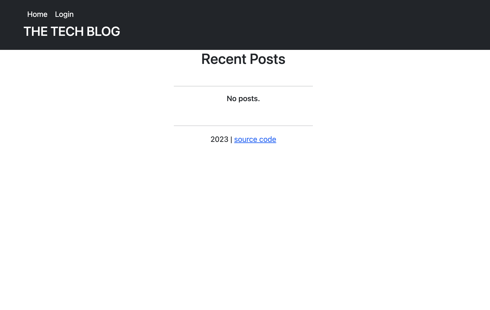

# techblog
### A simple yet functional blogging platform

This repository is for a node-express-handlebars-sequelize based blogging platform created for my UC Berkeley Coding Bootcamp.

If all is well, the page should display like in this screenshot:

There is no license for this project and it is intended for educational purposes only.